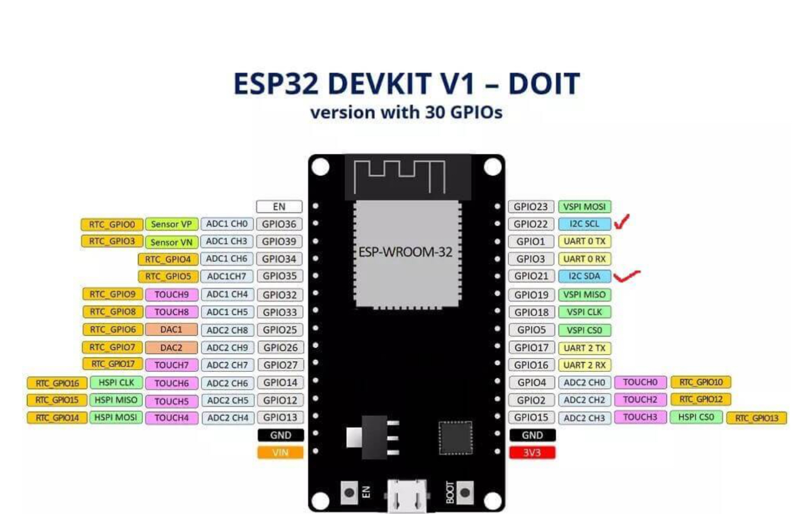

# IOT_Heating_Pad_esp32
An IOT heating pad based on Espressif esp32 module  

This project plans to use Espressif's ESP-32-DEV IoT module for control.  
According to the size of the ESP-32 module and relay, the control box model was designed using SOLIDWORKS and then 3D printed. (See the attachment for the original design file)  
Control logic: Get the resistance of GPIO36 and GPIO39 connected to the NTC thermistor through the function in the ESP-32 library, use Python to calculate the current temperature and convert it to Celsius. Determine the temperature through C++'s {calculation} syntax, and control the disconnection and attraction of the 12v relay connected to the PTC heating component by changing the high/low level signal connected to the GPIO2 and GPIO4 pins, so as to achieve the effect of constant temperature control. If the temperature is lower than the set threshold, the relay will open and energize the heating component. If the temperature reaches or exceeds the set threshold, the relay will close.

Next, we will implement IoT control. We use ESPHome firmware for custom compilation and add support for python to obtain the temperature value calculated by ESP-32. ESPHome modifies the set temperature by directly modifying the if (temperature >THERMO_THRESHOLD) segment. In ESPHome, it is used as a thermostat, which is easy to operate. We can also directly connect to Home Assistant through ESPHome, use Lovelace-UI for graphical control, and use Node-RED to edit automation to realize automatic operation of the device. The plan has been determined, and the parts and tools needed are prepared. We need: large mouse pad, 220V AC-12V DC 9A switching power supply, 12V DC-5V DC step-down module, DC5.5 male and female connector, Espressif ESP-32-DEV development module, 12v 80w PTC heating module, 2252Ω/25℃ NTC thermistor, rated temperature 42℃ thermistor (output high and low level signals), 4-core aviation connector (male and female), uniform heating plate, 12V10A electromagnetic relay, firmware burner, self-designed 3D printed control box (3D model and SOLIDWORKS project file are attached), breadboard(only for testing availability), Dupont wire.  
Before starting, first test the parts to ensure good compatibility. Testing with breadboard:
1. Material preparation: Prepare the following materials: ESP-32 module, heating pad, temperature sensor, relay,
breadboard, wire, power adapter and wire.
2. Hardware connection: Connect the ESP-32 module to the breadboard and make sure the connections are correct. Connect the temperature sensor and relay to the breadboard and use wires to connect them to the ESP-32 module.
3. Power connection: Connect the power adapter to the breadboard and make sure the power supply is stable.
4. Programming: Write code using Arduino IDE. Write code to read the data of the temperature sensor and control the relay switch according to the set temperature threshold. Then compile the firmware and burn it to the ESP-32 module (see the attached firmware). Since we are testing the hardware, the IoT-related firmware program is not used for the time being.
5. Testing and debugging: Ensure that the system is working properly by monitoring the temperature sensor readings and the status of the heating pad.
Check the hardware connections and code logic, and perform necessary debugging. Among them, we encountered some problems, such as: the difference between the high and low temperature thresholds was too large, resulting in a large temperature difference across the entire table mat, which could not achieve the effect of constant temperature; the threshold was too small, which would cause the relay to frequently close and disconnect, resulting in a lot of noise; we could only find the difference between constant temperature and silence through continuous testing, and then write the controlling logic.  

Connect the hardware:  
Connect the 12v 10a power supply to the DC5.5 male connector.  
Install the DC5.5 female connector and the female connector of the 4-pin aviation connector into the 3D printed control box.  
Install the ESP-32 module into the control box.  
Connect the rated temperature 42℃ thermistor (output high and low level signals) and the relay for high temperature protection to prevent people from being burned in case of accidents.  
Solder the used DuPont wires to the correct GPIO pins and relays and connectors, connect the relay output terminals to the 4-pin aviation connector, and the NTC thermistor and PTC heater to the other half of the connector.  
Install the PTC module under the heat plate, install the heat plate under the large mouse pad, and use a rubber pad to close the bottom.  
Import the required ESP-32 and ESPHome libraries in the Arduino IDE software, and add the necessary header files.  
In the ESPHome function, configure information such as Wi-Fi connection and device name.  
Add a temperature sensor component and define its pins and other settings.  
Add a Switch component to control the on/off state of the electromagnetic relay.  
In the setup function, initialize the temperature sensor and set the electromagnetic relay control pin to output mode.  
In the loop function, read the value of the temperature sensor and control the electromagnetic relay to close and close through conditional statements.  
Configure ESPHome:  
Open the ESPHome software and create a new configuration file.  
Copy the code written in the Arduino IDE to the ESP configuration file.  
Configure Wi-Fi SSID and Password, etc.  
Specify the pins and other settings of the temperature sensor.  
Configure the Switch component and connect it to the electromagnetic relay pin.  
Compile and burn:  
Click the "Compile" button in the ESPHome software to compile the code and generate the firmware file.  
Connect the ESP-32 module to the computer through the firmware burner, set the COM port and upload the compiled firmware.
(The firmware is attached)

Actual use:  
Connect the 2 connectors on the control box to the connectors on the heating pad.  
Plug the heating pad into the power adapter.  
Open the ESPHome server, find new devices and connect them. Next, open Home Assistant to add entities and add them to Lovelace-UI for manual temperature control. Use Node-RED to create automation for fully automatic personalized control of the heating pad: connect to Frigate-Face-Recognition through ESP-32-CAM to identify who is in front of the table, automatically turn on the heating and set it to his/her favorite temperature; automatically turn off after 5 minutes of leaving to save energy.  
Now it is more user-friendly to remotely control the switch of the heating pad, set the temperature, and view the current temperature through the WEB interface or mobile phone application.  
Assuming that the software control system crashes, the rated temperature of 42℃ thermistor will operate the relay to immediately disconnect the PTC heating module to prevent overheating and burns.  
Combined with Deep Stack, Compare Face, or projects, or using face recognition projects such as deep learning or OpenCV, you can also set different temperature values ​​according to different users to meet the customized needs of different groups of people.  




Here's an firmware example:  
```sh
esphome:
  name: temperature_control
  platform: ESP32
  board: esp32dev

# Wi-Fi configuration
wifi:
  ssid: "Your_SSID"
  password: "Your_PASSWORD"

# Enable log
logger:

# OTA update
ota:

# Configure web server
web_server:
  port: 80

# an NTC temperature sensor, assuming that a simple NTC temperature sensor is connected to an ADC pin
sensor:
  - platform: adc
    pin: GPIO36
    name: "NTC Temperature"
    id: ntc_temp
    update_interval: 10s
    filters:
      - multiply: 3.3  # needs to be adjusted according to the specific resistance and NTC characteristics
      - lambda: |-  # The temperature conversion formula must be adjusted according to the NTC characteristic curve
          return (10000.0 / (x - 10000.0)); # This is an example and needs to be replaced with the correct temperature conversion formula
          # return temperature in Celsius.

# Set the adjustable range for remote temperature control.
input_number:
  temperature_setpoint:
    name: "Temperature Setpoint"
    min: 36.0
    max: 40.0
    step: 0.1
    initial: 37.0

# Relay controlling
switch:
  - platform: gpio
    pin: GPIO2
    id: relay1
    inverted: True
    restore_mode: ALWAYS_OFF

  - platform: gpio
    pin: GPIO4
    id: relay2
    inverted: True
    restore_mode: ALWAYS_OFF

# Control relay logic based on temperature and set point
interval:
  - interval: 1s
    then:
      - if:
          condition:
            and:
              - lambda: 'return id(ntc_temp) < id(temperature_setpoint);'
          then:
            - switch.turn_on: relay1
            - switch.turn_off: relay2
          else:
            - switch.turn_off: relay1
            - switch.turn_on: relay2
```


Notes:   
The firmware flashing tool is in the /tools directory  
When using FDM printers for 3D printing, pay attention to these settings:  
Recommended settings:  
The nozzle is set according to your own machine  
Fill 30%  
Print Support is to open  
"Attached" to be opened  
